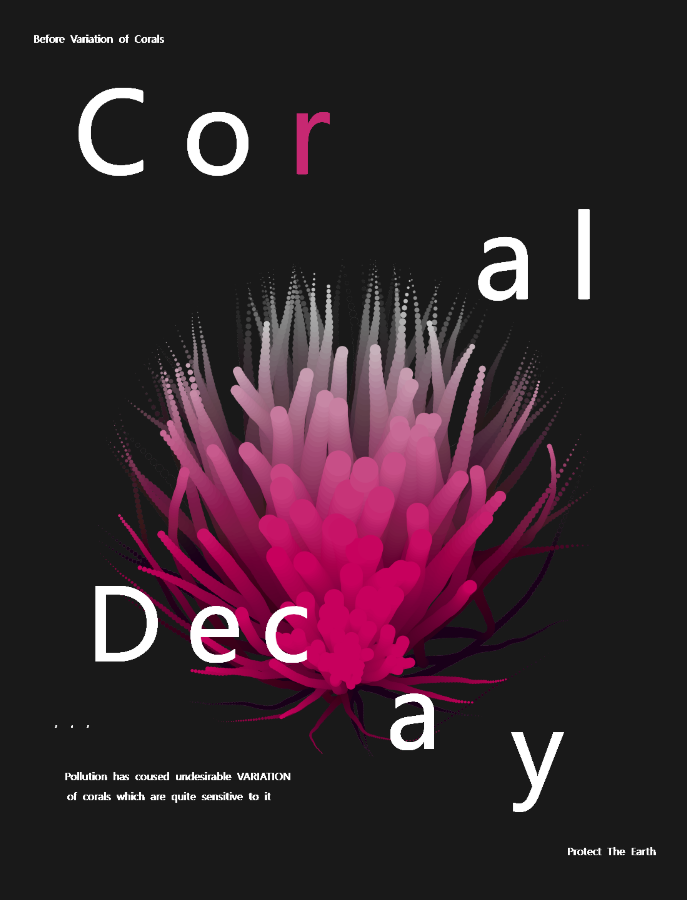
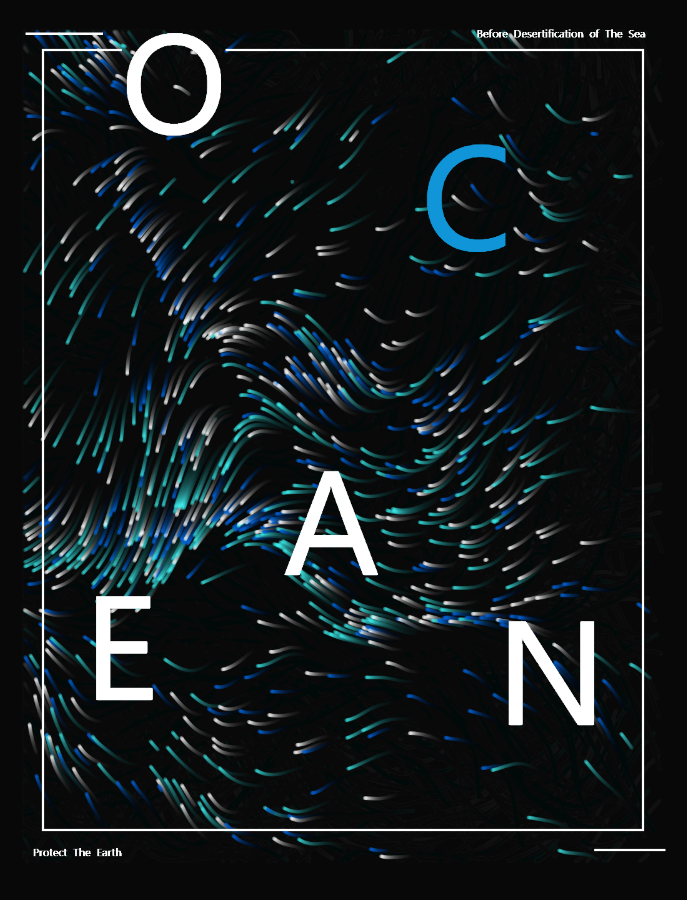
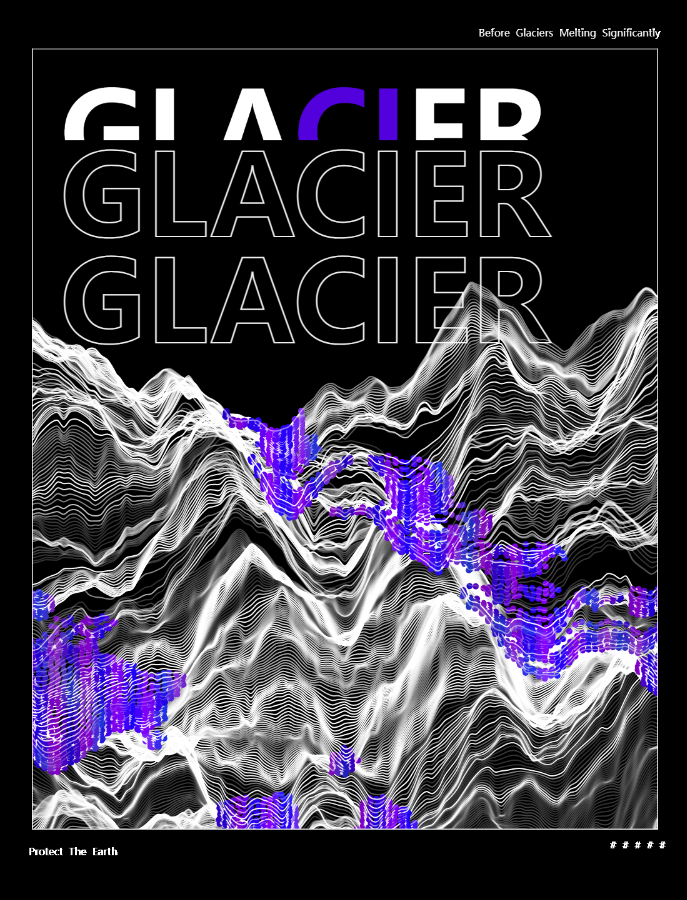
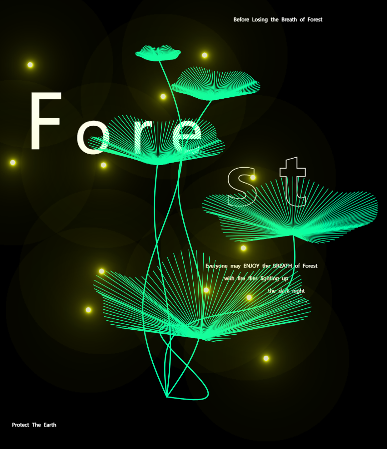
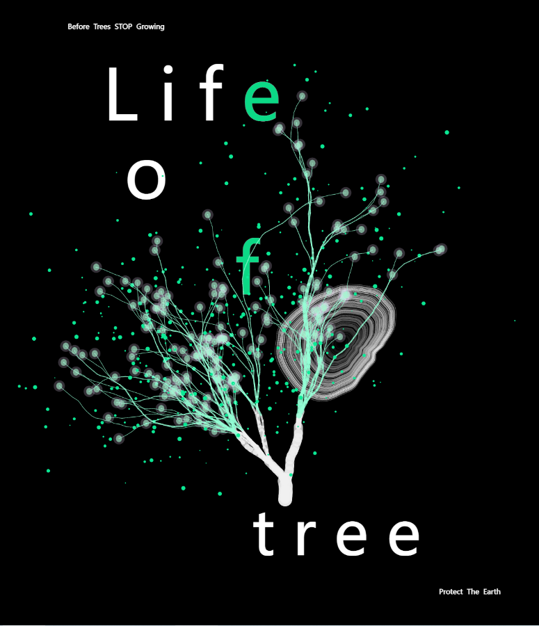
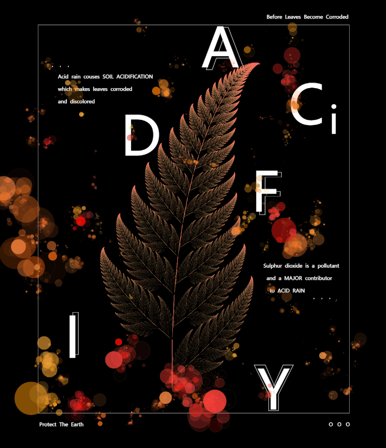
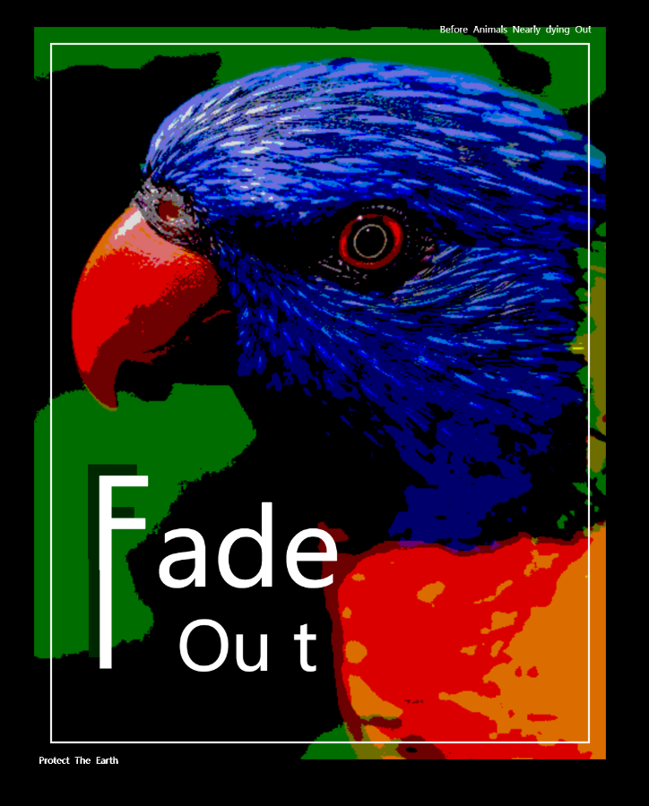
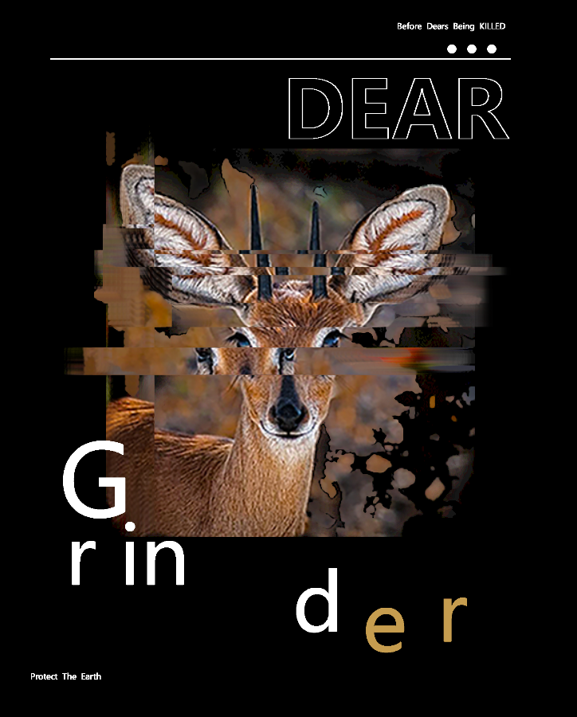
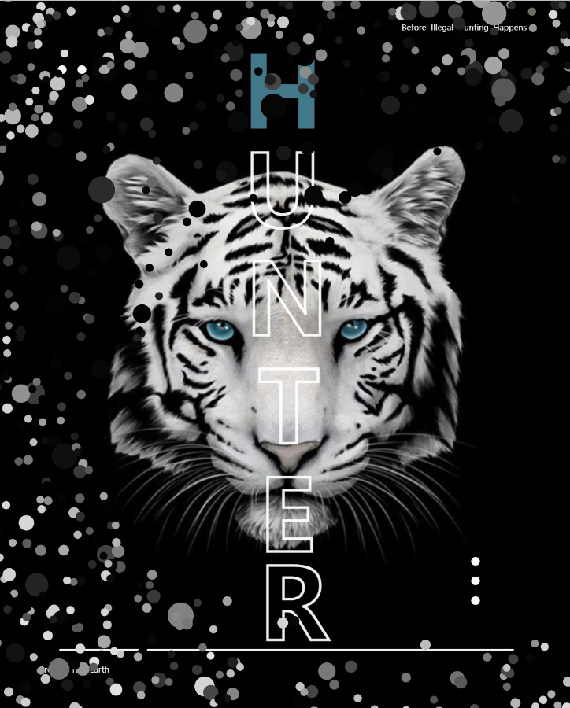
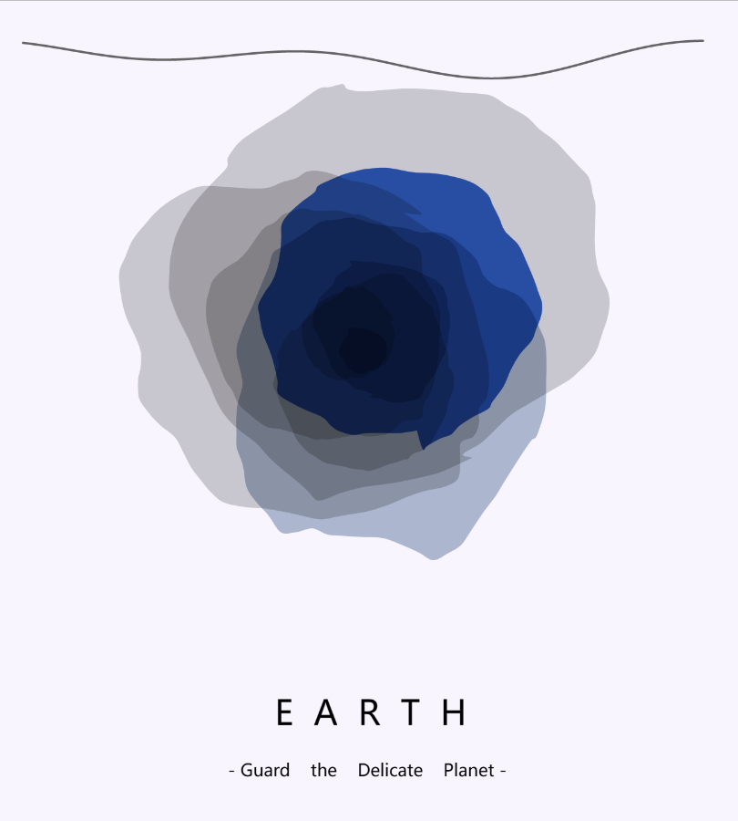

# ☄️期末作业-创意编程创作作品展示

# 
Before

— Before Everything Is Too Late, Save the Earth —

工业发展之下

冰川融化、海洋污染、土壤酸蚀、非法猎杀等现象频频发生

对技术理性的过度张扬激化了人与自然之间的矛盾

而要缓解这些矛盾

必须重新审视人与自然之间的关系

**
本作品以此为背景创作了一系列基于艺术编程的交互式动态海报
**
**
旨在引发人们对于环境的重视与思考
**

# 🌏作品展示

## 0. 简介

本作品以环保为背景创作了一系列基于艺术编程的**交互式动态海报**，包含 海洋、森林、动物 这**3个子系列**，一共**10个子作品**，每个均可独立运行，均有动态效果和**鼠标交互**功能。

演示视频链接：[哔哩哔哩 (゜-゜)つロ 干杯~-bilibili](https://www.bilibili.com/video/BV19g411b716/?spm_id_from=333.999.0.0)

## 1. 海洋系列

<table style="table-layout: fixed; width: 100%;">
    <colgroup>
        <col style="width: 33.33%;">
        <col style="width: 33.33%;">
        <col style="width: 33.33%;">
    </colgroup>
    <tr>
        <td>
静态展示
</td>
        <td>
珊瑚变异
</td>
        <td>
点击交互
</td>
    </tr>
    <tr>
        <td>
静态展示
</td>
        <td>
海洋沙化
</td>
        <td>
长按交互
</td>
    </tr>
    <tr>
        <td>
静态展示
</td>
        <td>
冰川消融
</td>
        <td>
长按+移动交互
</td>
    </tr>
</table>

## 2. 森林系列

<table style="table-layout: fixed; width: 100%;">
    <colgroup>
        <col style="width: 33.33%;">
        <col style="width: 33.33%;">
        <col style="width: 33.33%;">
    </colgroup>
    <tr>
        <td>
静态展示
</td>
        <td>
森林之息
</td>
        <td>
点击+滚轮交互
</td>
    </tr>
    <tr>
        <td>
静态展示
</td>
        <td>
生命之树
</td>
        <td>
点击交互
</td>
    </tr>
    <tr>
        <td>
静态展示
</td>
        <td>
土壤酸化
</td>
        <td>
长按+滚轮交互
</td>
    </tr>
</table>

## 3. 动物系列

<table style="table-layout: fixed; width: 100%;">
    <colgroup>
        <col style="width: 33.33%;">
        <col style="width: 33.33%;">
        <col style="width: 33.33%;">
    </colgroup>
    <tr>
        <td>
静态展示
</td>
        <td>
动物灭绝
</td>
        <td>
移动交互
</td>
    </tr>
    <tr>
        <td>
静态展示
</td>
        <td>
滥杀动物
</td>
        <td>
长按+滚轮交互
</td>
    </tr>
    <tr>
        <td>
静态展示
</td>
        <td>
非法猎者
</td>
        <td>
移动交互
</td>
    </tr>
</table>

## 4. 封页

<table style="table-layout: fixed; width: 100%;">
    <colgroup>
        <col style="width: 50%;">
        <col style="width: 50%;">
    </colgroup>
    <tr>
        <td>
静态展示
</td>
        <td>
移动交互
</td>
    </tr>
</table>

# 🌏算法介绍

- ### **精简**

    本作品力求通过最精简的代码将码绘的视觉艺术效果展现到极致。
    
- ### **详尽**
    
    基于**形象建模**，10幅作品运用的算法各不相同，核心算法包括：**分形结构**，**递归树**，**粒子系统模拟**，**柏林噪声可视化**等。它们共同贯彻的思路是“类”与“随机性”：本代码对所有物体都进行了类的封装，并通过随机数、随机过程对生命状态进行模拟。
